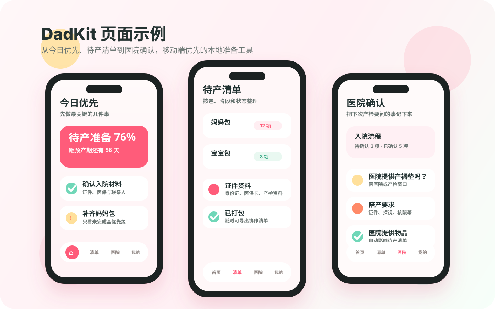
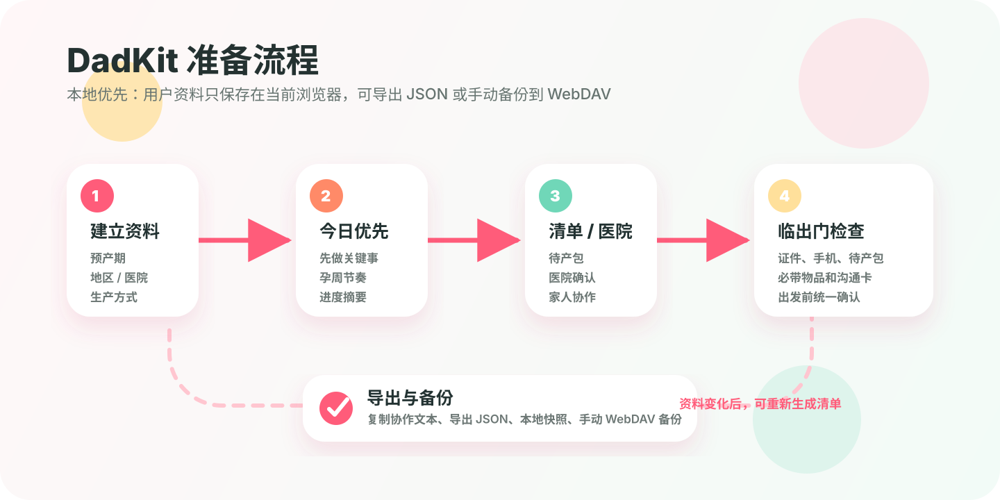

# DadKit v1.3 🧳

DadKit 是一个给孕晚期家庭使用的本地优先待产准备 PWA。v1.3 把全站视觉统一为「精致现代简约风」：微粉暖白底、珊瑚粉主色、统一卡片/行/图标块规范（见 `docs/design/design-system.md`），去掉了贴纸插画和马卡龙渐变。待产包模板内置 123 个条目，每项配有物品级图标、数量参考和操作说明。功能上继续把准备方案收束成四根柱子：医院确认、核心待产包、临出门沟通卡和产后提醒，让“现在该做什么、还差什么、能发给谁看”变得更清楚。

它适合这样的场景：

- 🤰 准妈妈想知道待产准备有没有漏项。
- 🧑‍🤝‍🧑 家人想帮忙分担确认、打包、沟通和产后待办。
- 🏥 每次产检后，需要把医院规则、入院流程、陪产要求和提供物品记录下来。
- 🔒 不想注册账号，也不想把隐私资料默认上传到云端。

DadKit 不是母婴电商清单，不提供购物链接或商品推荐；也不是医疗建议工具或医院官方规则库。所有医院规则、入院动线、陪产要求、提供物品和产后办理材料，都应以最近一次产检、入院须知、医院通知或当地窗口为准。

## 🖼️ 项目预览


### 功能示例



### 使用流程



## ✨ 核心功能

- 🧭 **四根柱子**：首页用医院确认、核心待产包、临出门沟通卡和产后提醒展示方案进度。
- 🗓️ **今日优先**：根据预产期和当前准备状态，显示今天最值得先做的几件事。
- 🧳 **动态待产清单**：根据地区、医院、生产方式和用户条件生成准备事项。
- 🛒 **购物清单**：只显示真正可能需要购买或补货、且尚未完成的物品。
- 🏥 **医院确认**：记录下次产检要问的问题、医院提供物品、陪产探视、缴费结算和出院办理信息。
- 🚗 **临出门模式**：把证件、手机、充电器、妈妈包、宝宝包、安全座椅、医院电话和路线信息集中到出发前检查。
- ⏱️ **宫缩记录**：记录开始、结束、持续、间隔和备注，可导出给医生参考。
- 📝 **临出门沟通卡**：整理紧急联系人、陪产人、医院电话、过敏、用药、路线和沟通偏好。
- 🍼 **产后办理提醒**：出生医学证明、出院结算、医保/生育保险、户口、居住证、产后复查和新生儿复查。
- 💾 **导出与协作**：分享四柱子摘要、家人协作清单、临出门版、医院沟通版、产后提醒和 JSON 备份。
- 📱 **PWA 支持**：可安装到手机桌面，支持基础离线访问和新版本提示。

## 🧭 页面导览

- `/`：首页，显示孕期档案、今日行动、关键进度和主要入口。
- `/setup`：创建或修改预产期、地区、医院、生产方式等资料。
- `/checklist`：待产清单、购物清单、证件、临出门等视图。
- `/hospital`：医院确认、下次产检要问、家人要确认。
- `/timeline`：按预产期生成准备时间线。
- `/go`：临出门检查。
- `/contractions`：宫缩记录。
- `/birth-plan`：临出门沟通卡。
- `/postpartum`：产后办理待确认。
- `/share`：导出与协作，包括准备摘要、家人协作清单、临出门版、医院沟通版、沟通卡、产后提醒、宫缩记录和 JSON 备份。
- `/settings`：资料、工具入口、本地快照、JSON 备份、WebDAV 备份和版本信息。
- `/healthz`：健康检查，返回 `ok`、`version`、`buildTime`。

## 🛠️ 本地开发

```bash
npm install
npm run dev
```

默认开发地址：

```text
http://localhost:3000
```

最小验证命令：

```bash
npm run lint
npm run test
npm run build
```

## 🚀 VPS Docker 部署

容器默认端口为 `3333`，并且只绑定 VPS 的 `127.0.0.1`。公网访问应通过 Caddy、Nginx 等 HTTPS 反向代理进入，不建议直接暴露 `3333` 端口。

一键部署（把域名替换成自己的 HTTPS 地址）：

```bash
curl -fsSL https://raw.githubusercontent.com/YePiXpert/dadkit/main/scripts/docker-deploy.sh \
  | sudo env DADKIT_PUBLIC_ORIGIN=https://dadkit.example.com sh
```

默认部署目录为 `/opt/dadkit`。DadKit 没有账号系统；只要实例能从公网访问，尤其启用 WebDAV 代理时，就必须在反向代理层配置 Basic Auth、单点登录或访问白名单。以 Caddy 的 `basic_auth` 为例，先用 `caddy hash-password` 生成密码哈希，再替换下面的占位值：

一键脚本只会在部署目录尚无 `.env` 时，把显式传入的部署变量写入该文件；已有 `.env` 不会被脚本覆盖。后续调整域名、端口或 WebDAV 允许列表时，请编辑 `/opt/dadkit/.env` 后再运行更新脚本。

```caddyfile
dadkit.example.com {
  encode zstd gzip
  basic_auth {
    dadkit <替换为密码哈希>
  }
  reverse_proxy 127.0.0.1:3333
}
```

健康检查：

```bash
curl http://127.0.0.1:3333/healthz
```

一键更新：

```bash
curl -fsSL https://raw.githubusercontent.com/YePiXpert/dadkit/main/scripts/docker-upgrade.sh | sudo sh
```

如果服务器部署目录没有需要保留的本地修改，但远端历史重写导致 fast-forward 失败，可以显式对齐远端：

```bash
curl -fsSL https://raw.githubusercontent.com/YePiXpert/dadkit/main/scripts/docker-upgrade.sh | sudo env DADKIT_FORCE_RESET=1 sh
```

自定义目录、端口、分支或公网地址：

```bash
curl -fsSL https://raw.githubusercontent.com/YePiXpert/dadkit/main/scripts/docker-deploy.sh \
  | sudo env DADKIT_DIR=/srv/dadkit DADKIT_PORT=3333 DADKIT_BRANCH=main \
      DADKIT_PUBLIC_ORIGIN=https://dadkit.example.com sh
```

可用环境变量：

- `DADKIT_DIR`：部署目录，默认 `/opt/dadkit`
- `DADKIT_PORT`：宿主机端口，默认 `3333`；容器内部固定使用 `3333`
- `DADKIT_BIND_ADDRESS`：宿主机监听地址，默认 `127.0.0.1`；只有明确了解风险时才改为 `0.0.0.0`
- `DADKIT_PUBLIC_ORIGIN`：反向代理对外提供的 HTTPS origin，例如 `https://dadkit.example.com`，不要带路径或末尾 `/`
- `DADKIT_WEBDAV_PROXY_ALLOWED_HOSTS`：WebDAV 代理允许访问的精确主机列表，逗号分隔，例如 `webdav.123pan.cn,dav.example.com:8443`；不支持通配符，留空时代理关闭
- `DADKIT_BRANCH`：部署分支，默认 `main`
- `DADKIT_REPO`：部署仓库，默认 `https://github.com/YePiXpert/dadkit.git`
- `DADKIT_IMAGE`：Docker Compose 镜像名，默认 `dadkit:latest`
- `DADKIT_BUILD_TIME`：构建时间，脚本默认自动写入 UTC 时间
- `DADKIT_WAIT_TIMEOUT`：等待容器通过健康检查的秒数，默认 `120`
- `DADKIT_FORCE_RESET=1`：强制把部署目录对齐到 `origin/$DADKIT_BRANCH`

手动部署：

```bash
git clone https://github.com/YePiXpert/dadkit.git /opt/dadkit
cd /opt/dadkit
cp .env.example .env
# 编辑 .env，至少填写 DADKIT_PUBLIC_ORIGIN；需要 WebDAV 时再填写允许的主机
DADKIT_BUILD_TIME="$(date -u +"%Y-%m-%dT%H:%M:%SZ")" docker compose up --build -d
```

手动更新：

```bash
cd /opt/dadkit
git pull --ff-only
DADKIT_BUILD_TIME="$(date -u +"%Y-%m-%dT%H:%M:%SZ")" docker compose up --build -d --remove-orphans
docker image prune -f
```

常用运维命令：

```bash
cd /opt/dadkit
docker compose ps
docker compose logs -f
docker compose restart
docker compose down
```

## 🔐 数据与隐私

DadKit 不需要登录，不使用后端数据库。用户资料、清单状态、自定义项目、医院确认、时间线任务、宫缩记录、临出门沟通卡和产后办理清单都保存在当前浏览器本地。

主要 localStorage key：

- `dadkit:user-profile`
- `dadkit:checklist`
- `dadkit:custom-items`
- `dadkit:hidden-template-items`
- `dadkit:hospital-overrides`
- `dadkit:hospital-answers`
- `dadkit:timeline-task-statuses`
- `dadkit:contractions`
- `dadkit:birth-plan`
- `dadkit:postpartum-tasks`
- `dadkit:checklist-mode`
- `dadkit:snapshots`
- `dadkit:webdav-config`
- `dadkit:webdav-sync-state`
- `dadkit:webdav-secret`：仅在用户选择记住 WebDAV 凭据时使用

sessionStorage key：

- `dadkit:webdav-session-secret`：默认用于保存当前会话的 WebDAV 密码 / 应用密码

JSON 导入导出不会包含 WebDAV 密码或应用密码。导入旧 JSON 时，缺失的新字段不会覆盖当前浏览器里的宫缩记录、临出门沟通卡、产后办理清单或时间线状态。导入失败会保持本地数据不变。

本地快照只在导入、恢复、清空、创建新清单等可能覆盖数据的操作前自动创建，最多保留最近 5 份。

WebDAV 备份是手动上传 / 下载 JSON 备份。为避免凭据明文传输，连接地址必须使用 HTTPS。浏览器请求会经 DadKit 同源代理转发，避免 WebDAV 服务 CORS 限制；DadKit 不会重写 WebDAV 协议，也不会自动同步。VPS 部署时代理默认关闭，只有 `DADKIT_WEBDAV_PROXY_ALLOWED_HOSTS` 中列出的公网主机可访问，并且公网入口必须有反向代理认证或访问白名单。代理将单次请求限制为 3 MiB、上游响应限制为 8 MiB，并对请求和响应应用 30 秒绝对时限；超出时请改用本地 JSON 导入导出。

## ⚕️ 发布边界

- 不引入后端、登录、数据库或默认云同步。
- 不引入电商推荐、购物链接或商品导购。
- 不做医疗判断，不判断是否应该去医院。
- 不把未核验医院模板显示成官方规则。
- 不把证件、手机、协作任务、医院问题、安全座椅显示成“待购买”。

## 🧱 技术栈

- Next.js App Router
- React 19
- TypeScript
- Tailwind CSS
- shadcn/ui 风格本地组件
- Zustand
- localStorage / sessionStorage
- date-fns
- PWA service worker
- Docker / Docker Compose
- ESLint
- Vitest
